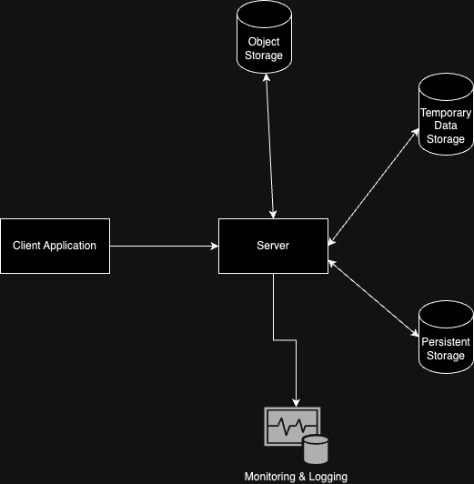

# Real-Time Vocabulary Quiz System Design

### Component Description
#### 1. Application (Frontend)
 - Allows users to join a quiz session and submit answers
 - Displays real-time leaderboard

#### 2. Backend Server
 - Pushes real-time updates to clients for leaderboard changes and session events
 - Manages sessions, validates answers, calculates scores, and updates the database

#### 3. Temporary Storage
 - Real-time score tracking and leaderboard caching

#### 4. Persistent Storage
 - Store the question metadata, the historical leaderboard
#### 5. Object Storage
 - Store the image, log file ...
#### 6. Monitoring & Logging Services
 - Tracks uptime, performance, and error rates.
 - Debug and troubleshoot the issue

### Data Flow
 - The user sends a `JOIN` request to the backend server with the quiz id and the user id
 - Server validates the session and user, and establishes the websocket connection for real-time communication
 - After the connection is established, the user sends the answer to the server
 - The server pushes updated leaderboard data to all users
 - Periodically, scores and session data are persisted to the Persistent Storage

### Technologies and Tools
| Component   |      Technology      |  Justification |
|----------|:-------------:|------:|
| Application (FE) |  React | Modern and responsive frameworks for UI |
| Backend Server |    FastAPI   |   Scalable, lightweight |
| Temporary Storage | Redis |    Suitable for caching |
| Persistent Storage | PostgreSql |     |
| Object Storage |  AWS S3 |     |
| Monitoring & Logging | Prometheus, Grafana, Splunk |     |